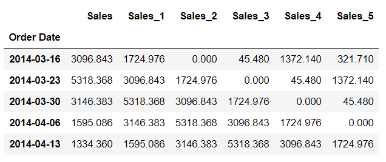
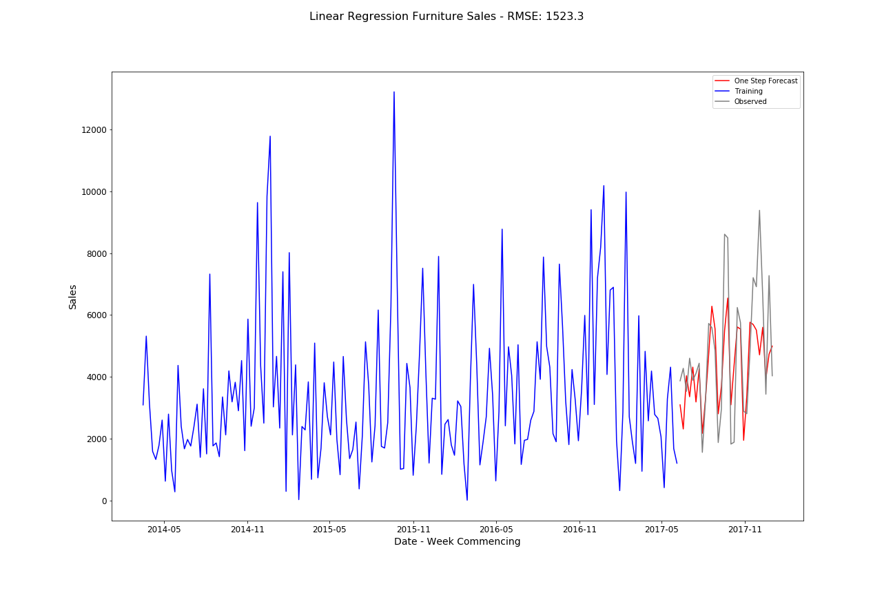
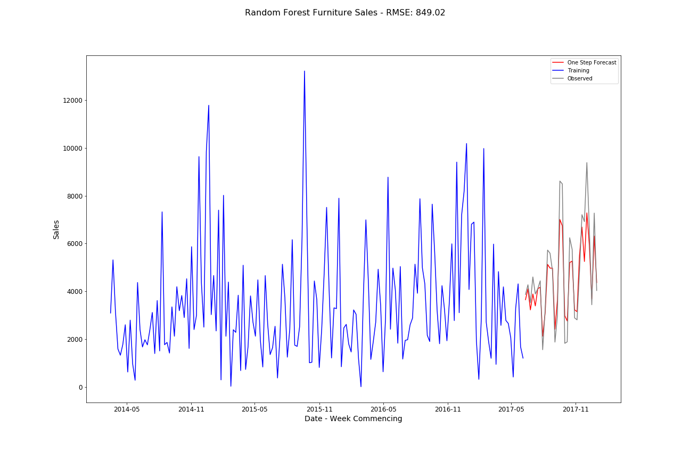

# Machine Learning Time Series Forecasting

[Code for this page](https://nbviewer.jupyter.org/github/AriadneData/Python_Time_Series/blob/master/TimeSeries_ML.ipynb)

The Machine Learning Methods covered are:

1. Linear Regression

2. Random Forest


All methods assume the dataframe has been created as in the ReadMe

### Further dataframe manipulation

___

Pandas provides a useful function **shift()** that allows previous timesteps to be included on the row. This adds previous timesteps as features.  The function below allows a variable number of lags. This was used with the GridSearch function to see the potential improvement with increasing the timesteps

```python
def shift_dataset(df, column_name, lags):  
  for each_lag in range(1,lags + 1):
    new_col = column_name + '_' + str(each_lag)
    df[new_col] = df[column_name].shift(each_lag)
     
	df.dropna(inplace = True)

	return df 
```
This creates a dataframe as follows:



A generalised function allows different modelling techniques to be used:
```python
from sklearn.model_selection import GridSearchCV

def forecast_sales(df, shifts, mdl, param_grid, cv = 5, title = 'Linear Regression' ):

    best_models = []
    best_models_rmse = []
    best_rmse = 99999999

    for each_shift in shifts:

        furniture_sales_weekly_copy = df.copy()
	
	# Shift the dataset to create features of previous timesteps
        furniture_sales_weekly_shift = shift_dataset(furniture_sales_weekly_copy,'Sales', each_shift)
	
	# Create the train and test datasets
        X_all, y_all, X_train, y_train, X_test, y_test = split_data(furniture_sales_weekly_shift, 0.8)

	# Set up teh Grid Search
        grid = GridSearchCV(mdl, param_grid, scoring=rmse_scorer(), cv = cv, verbose = 1)  
        grid.fit(X_all, y_all)
	
	# Get predictions from the best model
        best_model = grid.best_estimator_
        y_pred = best_model.predict(X_test)
        rmse = math.sqrt(mean_squared_error(y_test, y_pred))
	
	# Set up the best models
        best_models.append(best_model)
        best_models_rmse.append(rmse)

        if best_rmse > rmse:
            final_model = best_model
            best_rmse = rmse
            best_lag = each_shift

    # Output the best models
    print ('Best lag: {}'.format(best_lag))
    print (best_model)
    
    # Create best predictions from the final model
    y_pred = final_model.predict(X_test)
    rcParams['figure.figsize'] = 18,12
    plt, rmse = output_results(y_pred,furniture_sales_weekly['Sales'], title + ' Furniture Sales' )
    
    return plt
```

## 1. Linear Regression

Using standard Linear Regression from SKLearn and 50 timesteps produces the following result:



## 2. Random Forest

Using standard Random Forest Regression from SKLearn and 50 timesteps produces the following result. Five fold Grid Search was used to find the best model.

```python
RandomForestRegressor(bootstrap=True, criterion='mse', max_depth=5,
           max_features='auto', max_leaf_nodes=None,
           min_impurity_decrease=0.0, min_impurity_split=None,
           min_samples_leaf=1, min_samples_split=2,
           min_weight_fraction_leaf=0.0, n_estimators=100, n_jobs=None,
           oob_score=False, random_state=None, verbose=0, warm_start=False)
```




This shows a further improvement to the RMSE.