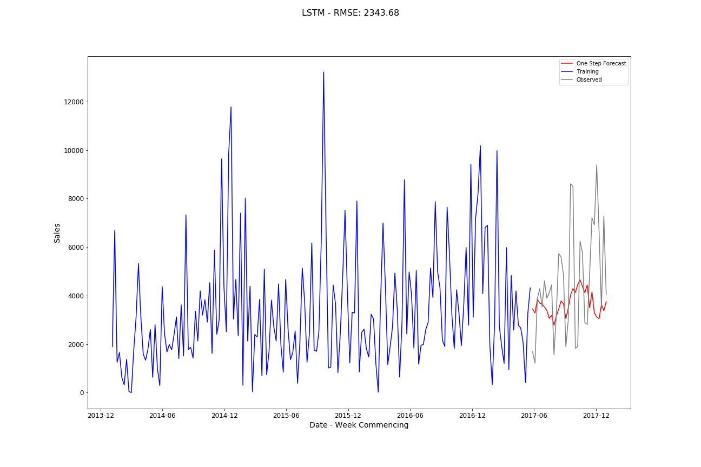

# DeepLearning Time Series Forecasting

[Code for this page](https://nbviewer.jupyter.org/github/AriadneData/Python_Time_Series/blob/master/TimeSeries_Keras.ipynb)

The Deep Learning networks use Keras:

1. MLP
2. Vanilla LSTM

All methods assume the dataframe has been created as in the ReadMe

### Further dataframe manipulation

------

As in the previous section for Machine Learning the Pandas **shift()** function is used to create previous timesteps as features for the row.

MinMax Scalar was used to standardise the data set.

```
from sklearn.preprocessing import MinMaxScaler

def MinMax(df):
    scaler = MinMaxScaler(feature_range=(0, 1))
    df_scaled = pd.DataFrame(scaler.fit_transform(df))
    df_scaled.rename(columns = {0:'Sales'}, inplace = True)
    return df_scaled, scaler
```

It is necessary to reverse this to compare with previous RMSE:

```
y_pred_unscale = scaler.inverse_transform(y_pred)
y_test_reshape = np.array(y_test[0:]).reshape(-1, 1)
y_test_unscale = scaler.inverse_transform(y_test_reshape)
```

Note that the original test input is converted to a numpy array before the inverse scale. This can then be used in the previous routines used for analysis.

## 1. MLP

This is a simple Keras Sequential Model. The variable **lags** is the number of timesteps:

```
from keras.models import Sequential
from keras.layers import LSTM
from keras.layers import Dense

mlp_model = Sequential()
mlp_model.add(Dense(100, activation='relu', input_dim=lags))
mlp_model.add(Dense(100, activation='relu', input_dim=100))
mlp_model.add(Dense(1))
mlp_model.compile(optimizer='adam', loss='mse')

# fit model
mlp_model.fit(X_train, y_train, epochs=200, verbose=0)
```

[](https://github.com/AriadneData/Python_Time_Series/blob/master/images/MLP.png)

## 2. Vanilla LSTM

This is vanilla LSTM

```
from keras.models import Sequential
from keras.layers import LSTM
from keras.layers import Dense

model = Sequential()
model.add(LSTM(50, activation='relu', input_shape=(lags, 1)))
model.add(Dense(100, activation='relu'))
model.add(Dense(100, activation='relu'))
model.add(Dense(1))
model.compile(optimizer='adam', loss='mse')

# reshape from [samples, timesteps] into [samples, timesteps, features]
n_features = 1
X = X_train.values.reshape((X_train.shape[0],lags, n_features))

# fit model
model.fit(X, y_train, epochs=200, verbose=0)
```

The output is only slightly better than the standard MLP.

[](images/LSTM.png)

## 2. Stacked LSTM

This simply adds LSTM layers on top of the layer that feeds the neural network. This is kept shallow as adding extra layers did not make large improvements

```python
from keras.models import Sequential
from keras.layers import LSTM
from keras.layers import Dense

model = Sequential()
model.add(LSTM(50, activation='relu', return_sequences = True, input_shape=(lags, 1)))
model.add(LSTM(50, activation='relu'))
model.add(Dense(100, activation='relu'))
model.add(Dense(50, activation='relu'))
model.add(Dense(1))
model.compile(optimizer='adam', loss='mse')
```


There is some improvement on the Vanilla LSTM but is still underperforming compared to the MLP.