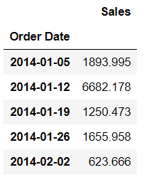
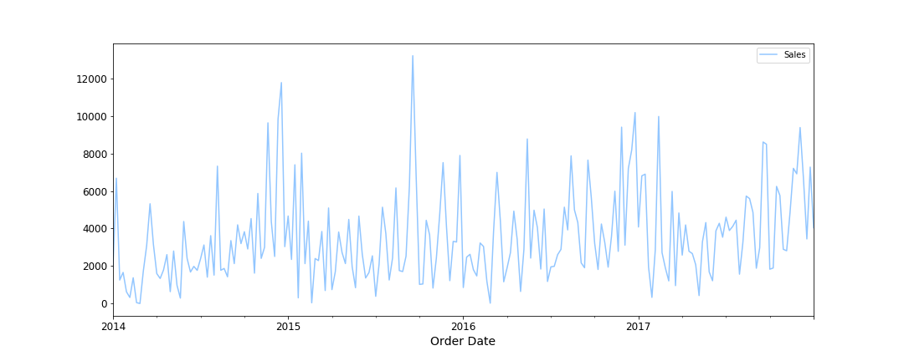
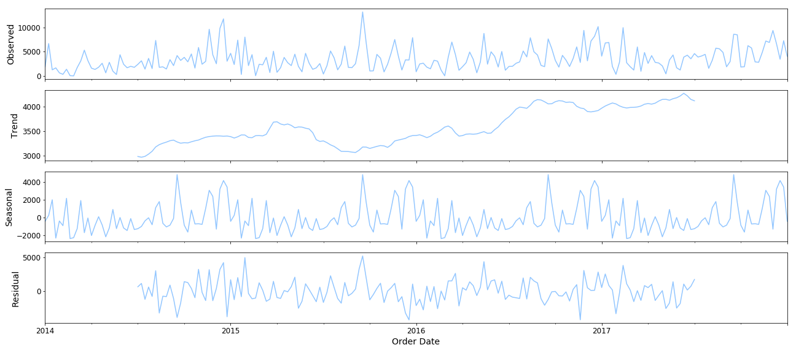
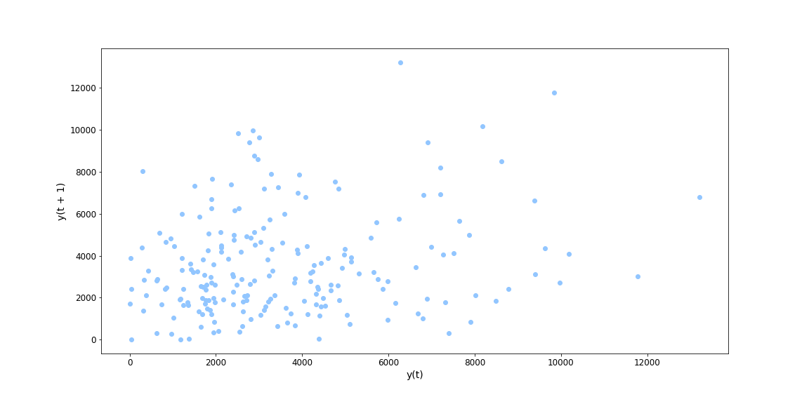
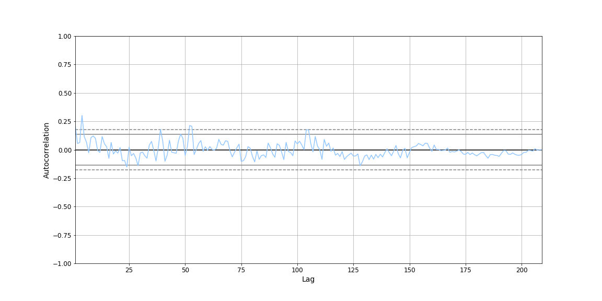
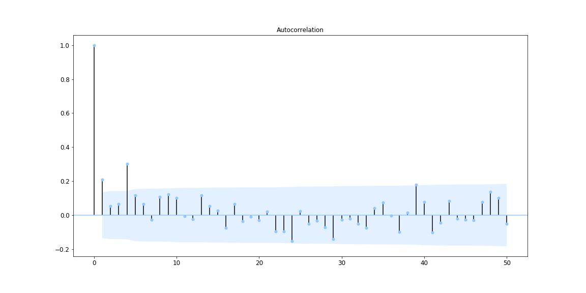
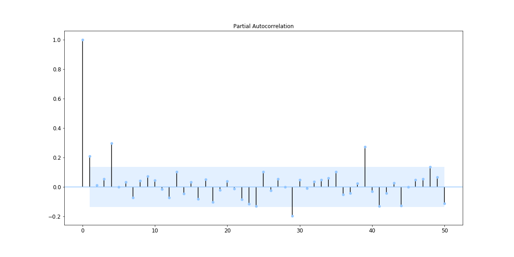

<span style = "font-family: Calibri; font-size:4em;"> # Univariate Time Series Forecasting

## Workbook that details the various methods of predicting timeseries data with examples
**Statistical Methods**

1.	Autoregression (AR)
2.	Moving Average (MA)
3.	Autoregressive Moving Average (ARMA)
4.	Autoregressive Integrated Moving Average (ARIMA)
5.	Seasonal Autoregressive Integrated Moving-Average with Exogenous Regressors (SARIMAX)
6.	Holt Winter’s Exponential Smoothing (HWES)

**Machine Learning Methods**
1.	Linear Regression
2.	Random Forest

**Keras LSTMs**
1.	Vanilla LSTM
2.	Stacked LSTM


## Building the dataset

Data source https://community.tableau.com/docs/DOC-1236 from here. I converted this to .csv and made the necessary changes in to the data in pandas.

1) As the date is in a string format in the csv this was changed to Python DateTime  and added as the index

2) The sales data was subset into 'Furniture'


## Aggregate the Dataset

The sales data appears to be at order id level so it needs to be summarised by the timeframe for the analysis. This analysis looks at sales on a weekly basis. Fortunately, pandas can do this easily for us.


```python
# Create a weekly set for predictions
furniture_sales_weekly = pd.DataFrame(furniture_sales['Sales'].resample('W').sum())
```

The dataframe looks like this:




## Overview of the Sales Data

The chart below shows the weekly sales data. There appears to be some peaks and troughs so there is the possibility that the data has seasonality.



## Seasonal decomposition:

Using statsmodels (https://www.statsmodels.org/dev/index.html) it is possible to look at any seasonality

```python
sm.tsa.seasonal_decompose(furniture_sales_weekly,model='addition')
```



We can see that Sales are trending upwards and there is a certain amount of seasonality.


## Time Lag

Firstly, this shows the correlation between the sales and the previous timestep. The correlation looks low and using Pearson correlation it is only 0.21

```python
# Lag plot using pandas
pd.plotting.lag_plot(furniture_sales_weekly['Sales'] )
```



Pandas has an autocorrelation plot that allows the comparison of timesteps over the whole series.

```python
pd.plotting.autocorrelation_plot(furniture_sales_weekly['Sales'])
```

which gives:



Statsmodels also has autocorrelation plot and a partial correlation plot, the lag has been set to 50 weeks or timesteps:

Autocorrelation plot shows the correlation with the preceding timesteps. The greater the spike the stronger the correlation. An upward spike is a positive correlation and the downward spike is a negative correlation.

```python
from statsmodels.graphics.tsaplots import plot_acf

plot_acf(furniture_sales_weekly['Sales'], lags = 50)
```



Partial Autocorrelation accounts for the values of the series in-between.

```python
from statsmodels.graphics.tsaplots import plot_pacf
plot_pacf(furniture_sales_weekly['Sales'], lags =50)
```



The possible methods of time series forecasting have been split into three groups:

1)  [Classical Time Series Forecasting](02_ClassicalTimeSeriesForecating.md)

2)  [Machine Learning Time Series Forecasting](03_MLTimeSeriesForecating.md)

3) [Keras Time Series Forecasting](04_DLTimeSeriesForecating.md)


## References

1. Machine Learning Mastery Classical Time Series (06/2019) (https://machinelearningmastery.com/time-series-forecasting-methods-in-python-cheat-sheet/)
2. An End-to-End Project on Time Series Analysis and Forecasting with Python (06/2019) (https://towardsdatascience.com/an-end-to-end-project-on-time-series-analysis-and-forecasting-with-python-4835e6bf050b)